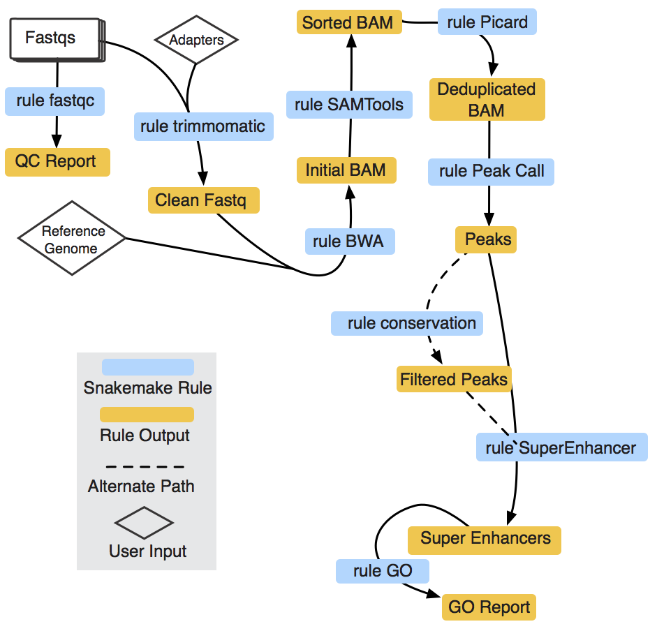

SEpipe: An Automated Cloud-based Super Enhancer Analysis Pipe
-----------
A super enhancer (SE) is a genomic locus on the genome that has a cluster of enhancers in close proximity. Identification of SEs is a three-step process that begins with the identification of enhancers followed by clustering or stitching enhancers that lie is close physical proximity. An accepted parameter for scanning enhancers for clustering or stitching is 12.5 kilo bases (kb). In the final step, the stitched enhancer regions are ranked by signal enrichment to identify putative SE's. A simple visualization plot known as hockey-stick plot is generated, an inflection point in this plot is identified as cut-off to generate a list of putative enhancers. Here we present a cloud-based, fully automated pipeline to identify SEs from H3K27ac based sequencing data sets. In addition to standard SE analysis, we also incorporate the prior knowledge of conservation. Using conservation knowledge, users can reduce false positives in the SE identification process.

SEpipe Workflow 
--------

  

Usage:
-------

